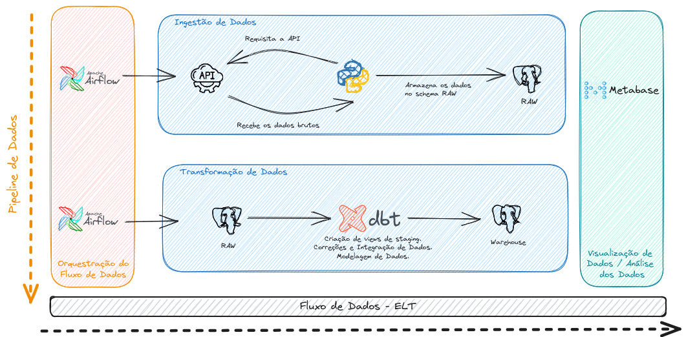
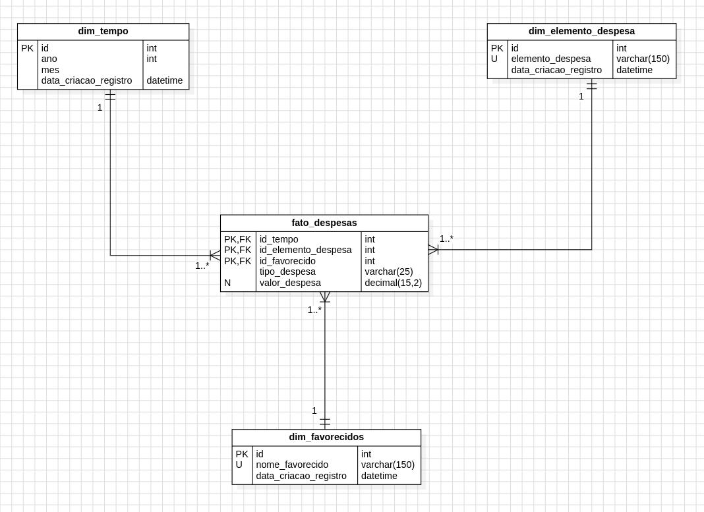
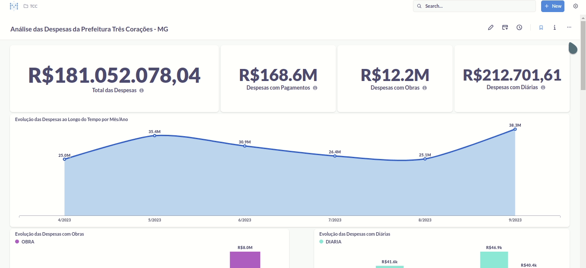

# Criação de um Processo de ELT utilizando Python, Airflow, DBT e Metabase

> Fluxo de dados que coleta os dados de uma API, realiza o tratamento de dados, modelagem dimensional e criação de painel com indicadores de análise. Projeto construído como trabalho de conclusão de curso da Pós-Graduação em Engenharia de Dados da PUC Minas.

- O pipeline foi criado a partir dos dados disponibilizados pela API de despesas da prefeitura de Três Corações-MG.
- O projeto extrai os dados da API utilizando a linguagem `Python` e realiza o tratamento e modelagem dos dados utilizando o `DBT`.
- Os dados são armazenados no banco de dados `Postgres`.
- Toda a execução do projeto é orquestrada pelo `Apache Airflow`.
- Ao final, a análise dos dados é disponibilizada via `Metabase`.



## Stack de Tecnologias
- [Apache Airflow v2.7.1](https://airflow.apache.org/)
- [DBT v1.6.3](https://www.getdbt.com/)
- [Docker v24.0.6](https://docs.docker.com/)
- [Docker Compose v2.21.0]()
- [Metabase v0.47.2](https://www.metabase.com/)
- [PostgreSQL v13.12](https://www.postgresql.org/)
- [Python v3.8.18](https://www.python.org/)

## Decisões Arquiteturais do Projeto

No projeto, diversas decisões arquiteturais foram cuidadosamente consideradas para garantir a eficácia e eficiência do sistema. Aqui estão algumas das decisões fundamentais:

Optou-se pelo `Apache Airflow` como orquestrador de pipelines devido à sua reconhecida liderança no mercado e à capacidade de personalização. Ele também oferece escalabilidade, suportando processamento distribuído.

A escolha do `DBT` como ferramenta de transformação de dados se deu devido à sua robustez e flexibilidade. Ele é integrado e orquestrado pelo `Apache Airflow`, permitindo o uso da linguagem `SQL` para modelagem de dados.

O banco de dados `PostgreSQL` foi selecionado por sua qualidade comprovada, sendo uma opção de código aberto altamente escalável, extensível e com ótimo desempenho em diversas situações.

A utilização do `Docker` foi feita visando maior compatibilidade e flexibilidade no ambiente de execução do projeto. Essa abordagem permite a implementação em diversos ambientes, incluindo soluções serverless em plataformas de cloud.

O `Metabase` se destaca por sua interface intuitiva e amigável, facilitando a criação de relatórios interativos e análise de dados, tornando o processo eficiente e acessível até mesmo para usuários de negócios.

Essas decisões arquiteturais foram essenciais para moldar um sistema robusto e eficaz, capaz de atender às demandas do projeto de Engenharia de Dados.

## Pipeline de Dados


O pipeline de dados foi projetado para orquestrar o fluxo de informações de maneira eficiente. Ele é composto por duas tarefas essenciais:

1. **executaCrawler**: Esta tarefa é responsável por requisitar dados da API e salvá-los nas tabelas do banco de dados, armazenando-os no esquema de staging. Aqui, os dados brutos são coletados e preparados para a próxima etapa de transformação.
2. **dbtRun**: Essa tarefa desempenha um papel crítico como o gatilho de execução das transformações do DBT. Ela tem como função principal adquirir os dados da camada de staging, realizar as transformações necessárias e, finalmente, salvar os dados no esquema do warehouse. Isso garante que os dados estejam prontos para serem consumidos de maneira eficiente.

Este pipeline de dados é fundamental para a integração e preparação de dados, assegurando que os dados brutos sejam transformados em informações úteis e acessíveis para análises posteriores.

## Modelo Multidimensional do Data Warehouse


No projeto, foi desenvolvido um modelo multidimensional no Data Warehouse que organiza os dados de maneira eficiente para análises abrangentes. O diagrama acima ilustra a estrutura do modelo, que consiste nos seguintes componentes:

- **fato_despesas**: Esta tabela contém registros de despesas agregadas por competência, elemento da despesa, favorecido e tipo de despesa. Ela é o ponto central para análises detalhadas das despesas do município.
- **dim_favorecidos**: Essa dimensão inclui registros de todos aqueles que receberam os pagamentos da prefeitura. Ela oferece informações valiosas sobre os beneficiários dos fundos municipais.
- **dim_elemento_despesa**: Nesta dimensão, encontram-se registros que descrevem os diversos destinos das despesas, permitindo uma análise detalhada das categorias de gastos.
- **dim_tempo**: Esta é uma dimensão auxiliar projetada para suportar análises temporais. Ela permite a contextualização das despesas ao longo do tempo, facilitando a identificação de tendências e padrões.

Esse modelo multidimensional é essencial para a análise eficaz dos dados do projeto, permitindo insights significativos e contribuindo para a tomada de decisões informadas.

## Como Executar o Projeto
Para executar o projeto, utilize o ambiente `Docker`. Você pode inicializá-lo com o gerenciador `docker-compose` executando o seguinte comando no terminal:

```bash
$ docker compose build
$ docker compose up -d
```

Este comando iniciará o projeto em segundo plano, permitindo que você comece a trabalhar com ele. Certifique-se de que o Docker e o Docker Compose estejam instalados e configurados corretamente antes de executar esse comando.

## Dashboard

Para acessar o dashboard, basta utilizar o seguinte endereço: http://localhost:3000. Utilize as seguintes credenciais de acesso:

**login**: julioszeferino@gmail.com

**senha**: 123.AFVCy

O dashboard fornece uma interface interativa para análise de dados e visualização de informações relevantes do projeto.

## Referências
Documentação da API de Despesas: https://trescoracoes-mg.portaltp.com.br/api/dadosabertos.aspx

Instalação do Docker Engine: https://docs.docker.com/engine/install/

> A documentação da API de Despesas fornece informações detalhadas sobre os dados usados no projeto, enquanto o link para a instalação do Docker Engine oferece orientações para configurar o ambiente Docker para a execução do projeto. Essas referências são úteis para entender e configurar o ambiente e acessar os dados necessários para o projeto.

## Histórico de Atualizações

* 0.0.1
    * Projeto Inicial

## Meta

Julio Zeferino - [@Linkedin](https://www.linkedin.com/in/julioszeferino/) - julioszeferino@gmail.com
[https://github.com/julioszeferino]
