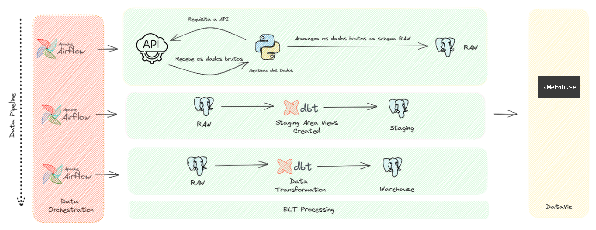

Criacao de um Processo de ELT utilizando Python, Airflow, DBT e Metabase

## Objetivos do Projeto

## Stack de Tecnologias

## Fluxo dos dados



## Outputs

docker-compose run webserver airflow db init
docker compose up airflow-init

```
$ dbt deps
dbt run -t prod


```


# Metabase
julioszeferino@gmail.com
senha 123.AFVCy

sudo chown julio:julio metabase-data